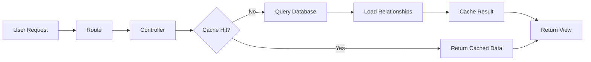

## Application Architecture

Heimdinger.lol is built on **Laravel 11** with a modern, maintainable MVC (Model-View-Controller) architecture. The application follows Laravel best practices and conventions to provide a clean separation of concerns.

### Technology Stack

- **Framework**: Laravel 11 (PHP 8.2+)
- **Database**: MySQL
- **Frontend**: Blade Templates, TailwindCSS, Vite
- **Server**: Laravel Octane (Swoole/RoadRunner)
- **Caching**: File-based cache with support for Redis
- **Monitoring**: Laravel Pulse

## Directory Structure

The application follows Laravel's standard directory structure with domain-specific organization:

```
app/
├── Console/
│   └── Commands/          # Artisan commands
├── Enums/                 # Enumeration classes
├── Helpers/               # Helper functions
├── Http/
│   ├── Controllers/       # Request handlers
│   └── Requests/          # Form request validation
├── Models/                # Eloquent models
├── Policies/              # Authorization policies
├── Providers/             # Service providers
├── Services/              # Business logic services
└── View/
    └── Components/        # Blade components
```

### Key Directories

<AccordionGroup>
  <Accordion title="Controllers" icon="route">
    Controllers handle HTTP requests and coordinate between models and views. Each controller focuses on a specific resource:
    
    - `ChampionController.php` - Champion listing and details
    - `ChampionSkinController.php` - Skin browsing and filtering
    - `SummonerIconController.php` - Summoner icon catalog
    - `PostsController.php` - Blog posts from Sheets
    - `SaleController.php` - Sale rotation data
  </Accordion>

  <Accordion title="Models" icon="database">
    Eloquent models represent database tables and relationships:
    
    - `Champion` - Champion data with skins, lanes, and streamers
    - `ChampionSkin` - Skin information and chromas
    - `ChampionRoles` - Champion lane data
    - `SummonerIcon` - Summoner icon assets
    - `SummonerEmote` - Emote assets
    - `Streamer` - Featured streamers per champion
  </Accordion>

  <Accordion title="Services" icon="gears">
    Services encapsulate complex business logic:
    
    - `BorisStaticDataClient` - Fetches champion data from Boris API with Meraki Analytics fallback
  </Accordion>

  <Accordion title="View Components" icon="puzzle-piece">
    Blade components for reusable UI elements organized by feature:
    
    - `Champions/` - Champion-related components
    - `Skins/` - Skin display components
    - `Icons/` - Icon grid components
    - `Posts/` - Blog post components
    - `home/` - Homepage components
  </Accordion>
</AccordionGroup>

## MVC Pattern

### Request Flow

<Steps>
  <Step title="Route Definition">
    Routes are defined in `routes/web.php` using Laravel's expressive routing:
    
    ```php routes/web.php
    Route::get('champion/{champion}', 
      static fn (Champion $champion) => (new ChampionController)->show($champion)
    )->name('champions.show');
    ```
  </Step>

  <Step title="Controller Processing">
    Controllers receive the request, interact with models, and return views:
    
    ```php app/Http/Controllers/ChampionController.php:28
    public function show(Champion $champion)
    {
        $threeDaysInSeconds = 60 * 60 * 24 * 3;
        
        $champion = Cache::remember(
            'championShowCache' . $champion->slug, 
            $threeDaysInSeconds, 
            static fn() => $champion->load('streamers', 'skins', 'lanes')
        );
        
        return view('champions.show', ['champion' => $champion]);
    }
    ```
  </Step>

  <Step title="Model Interaction">
    Eloquent models handle database queries and relationships:
    
    ```php app/Models/Champion.php:82
    public function skins(): HasMany
    {
        return $this->hasMany(ChampionSkin::class, 'champion_id', 'champion_id');
    }
    
    public function lanes(): HasOne
    {
        return $this->hasOne(ChampionRoles::class, 'champion_id', 'champion_id');
    }
    ```
  </Step>

  <Step title="View Rendering">
    Blade templates render the final HTML with the provided data:
    
    ```blade
    <h1>{{ $champion->name }}</h1>
    <p>{{ $champion->title }}</p>
    ```
  </Step>
</Steps>

## Data Flow

### Champion Data Pipeline



### Caching Strategy

The application uses aggressive caching to minimize database queries:

<CodeGroup>
```php Champion Index (8 hours)
$champions = Cache::remember('championsListAllCache', $eightHoursInSeconds, 
    static fn() => Champion::orderBy('name')->get()
);
```

```php Champion Details (3 days)
$champion = Cache::remember('championShowCache' . $champion->slug, $threeDaysInSeconds, 
    static fn() => $champion->load('streamers', 'skins', 'lanes')
);
```
</CodeGroup>

<Note>
  Cache keys are scoped per resource to allow selective invalidation when data updates.
</Note>

## Model Relationships

The application uses Eloquent relationships to model data connections:

```php
Champion
├── HasMany → ChampionSkin
│   └── HasMany → SkinChroma
├── HasOne → ChampionRoles
└── HasMany → Streamer
```

### Example: Loading Champion with Relationships

```php app/Http/Controllers/ChampionController.php:32
$champion->load('streamers', 'skins', 'lanes');
```

This eager loads all related data in a single query to avoid N+1 problems.

## Route Model Binding

Laravel's route model binding automatically resolves models using slugs:

```php app/Models/Champion.php:77
public function getRouteKeyName(): string
{
    return 'slug';
}
```

This allows clean URLs like `/champion/aatrox` instead of `/champion/1`.

## Service Provider Pattern

The `AppServiceProvider` bootstraps application services:

```php app/Providers/AppServiceProvider.php:38
public function boot(): void
{
    if (config('app.env') === 'production') {
        URL::forceScheme('https');
    }
    
    $this->bootAuth();
    $this->bootRoute();
}
```

### Key Registrations

- **Authorization**: Pulse access control for admin users
- **Rate Limiting**: API throttling (60 requests/minute)
- **Route Bindings**: Custom model resolution for blog posts via Sheets

<Warning>
  When modifying service providers, remember to clear the config cache:
  ```bash
  php artisan config:clear
  php artisan octane:reload
  ```
</Warning>

## Next Steps

<CardGroup cols={2}>
  <Card title="Data Sources" icon="database" href="/development/data-sources">
    Learn how the app integrates with Riot API, DataDragon, and Meraki Analytics
  </Card>
  <Card title="Artisan Commands" icon="terminal" href="/development/commands">
    Explore available CLI commands for maintenance and deployment
  </Card>
</CardGroup>